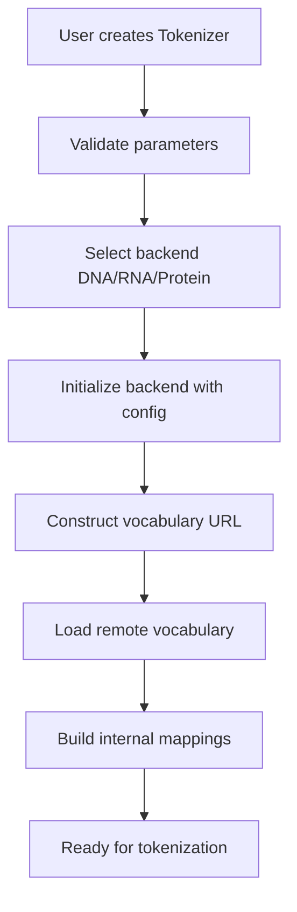
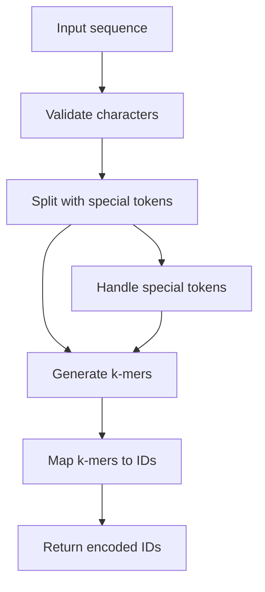
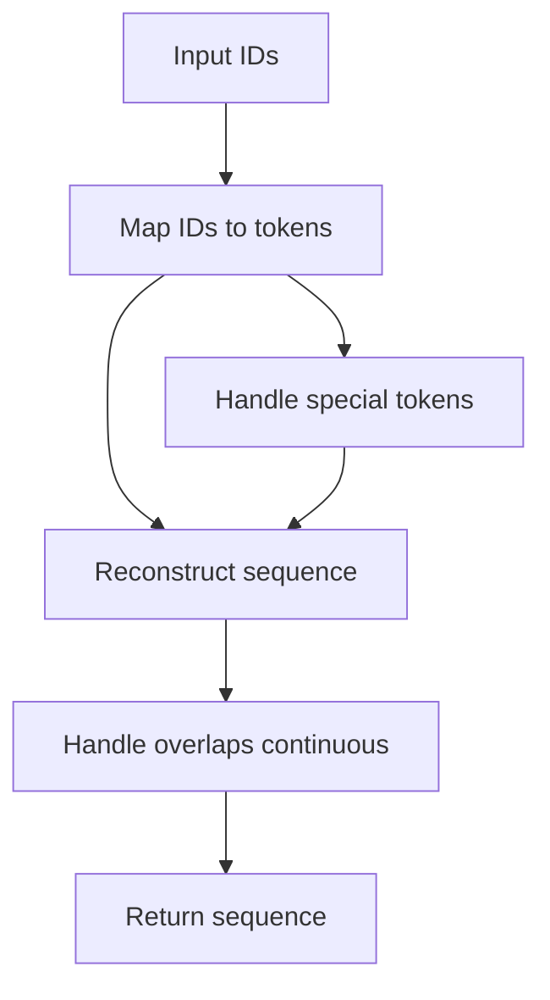

# Biosaic Tokenizer - Technical Documentation

## Table of Contents

1. [Architecture Overview](#architecture-overview)
2. [Codebase Structure](#codebase-structure)
3. [Design Patterns](#design-patterns)
4. [Core Components](#core-components)
5. [Data Flow](#data-flow)
6. [Vocabulary Management](#vocabulary-management)
7. [Tokenization Algorithms](#tokenization-algorithms)
8. [Special Token Handling](#special-token-handling)
9. [Remote Resource Loading](#remote-resource-loading)
10. [Error Handling Strategy](#error-handling-strategy)
11. [Testing Guidelines](#testing-guidelines)
12. [Performance Considerations](#performance-considerations)
13. [Contributing Guidelines](#contributing-guidelines)
14. [Release Process](#release-process)

## Architecture Overview

The Biosaic tokenizer follows a **facade pattern** with specialized backend implementations for different biological sequence types. The architecture consists of:

```sh
      ┌─────────────────────────────────────────┐
      │              Tokenizer                  │
      │            (Facade Class)               │
      ├─────────────────────────────────────────┤
      │    - Mode routing (DNA?RNA/Protein)     │
      │    - Configuration management           │
      │    - Remote vocabulary loading          │
      │    - Unified API exposure               │
      └─────────────────────┬───────────────────┘
                            │
        ┌───────────────────┴────────────────┐
        │                  │                 │
        ▼                  ▼                 ▼
┌─────────────┐    ┌─────────────┐    ┌─────────────┐
│    DNA      │    │   Protein   │    │     RNA     │
│  Backend    │    │   Backend   │    │   Backend   │
└─────────────┘    └─────────────┘    └─────────────┘
                          │                       
                          ├─ Tokenization Logic   
                          ├─ Vocabulary Management
                          ├─ Encoding/Decoding    
                          ├─ Validation           
                          └─ Biological Utilities 
```

### Key Architectural Decisions

1. **Separation of Concerns**: DNA, RNA and Protein logic are isolated in separate modules
2. **Facade Pattern**: Single entry point (`Tokenizer`) for all operations
3. **Remote-First Vocabularies**: Pre-trained vocabularies loaded from remote sources
4. **Immutable Configuration**: Tokenizer configuration is set at initialization
5. **Fail-Fast Validation**: Input validation occurs early in the pipeline

## Codebase Structure

```sh
biosaic/
├── _main.py          # Facade class and public API
├── _dna.py           # DNA-specific implementation
├── _rna.py           # RNA-specific implementation
├── _protein.py       # Protein-specific implementation
vocab/            # Remote vocabulary storage
├── dna/
│   ├── base_3k.model
│   └── cont_3k.model
├── rna/
│   ├── base_3k.model
│   └── cont_3k.model
└── protein/
    ├── base_2k.model
    └── cont_2k.model
```

### File Responsibilities

- **`_main.py`**: Public API, configuration management, backend routing
- **`_dna.py`**: DNA sequence tokenization, reverse complement, validation
- **`_rna.py`**: RNA sequence tokenization, reverse complement, validation
- **`_protein.py`**: Protein sequence tokenization, amino acid handling
- **Remote vocabularies**: Pre-computed k-mer vocabularies for different configurations

## Design Patterns

### 1. Facade Pattern

The `Tokenizer` class provides a unified interface hiding the complexity of backend selection and configuration.

```python
class Tokenizer:
    def __init__(self, mode: str, ...):
        # Route to appropriate backend
        if mode == "dna":
            self._tokenizer = DNA(...)
        elif mode == "rna":
            self._tokenizer = RNA(...)
        else:
            self._tokenizer = Protein(...)

    def encode(self, sequence: str) -> list[int]:
        return self._tokenizer.encode(sequence)  # Delegate to backend
```

### 2. Strategy Pattern

Different tokenization strategies (continuous vs non-continuous) are handled within each backend.

```python
def tokenize(self, sequence):
    if self.continuous:
        return self._continuous_tokenize(sequence)
    else:
        return self._non_continuous_tokenize(sequence)
```

### 3. Template Method Pattern

All DNA, RNA and Protein classes follow the same structure with specialized implementations.

```python
# Common interface across backends
def encode(self, sequence) -> List[int]:
    sequence = self._preprocess(sequence)      # Normalize
    tokens = self.tokenize(sequence)           # Tokenize
    return self._tokens_to_ids(tokens)         # Convert to IDs
```

### 4. Factory Pattern (Implicit)

The vocabulary building process follows a factory pattern for generating k-mer combinations.

```python
def build_vocab(self):
    letters = sorted(self._base_chars)
    if self.continuous:
        combos = list(product(letters, repeat=self.kmer))
    else:
        combos = []
        for L in range(1, self.kmer + 1):
            combos.extend(product(letters, repeat=L))
```

## Core Components

### 1. Tokenizer (Facade)

**Purpose**: Unified interface for all tokenization operations

**Key Methods**:

- `__init__()`: Configuration and backend selection
- `encode()`, `decode()`: Primary tokenization operations
- `tokenize()`, `detokenize()`: String-level operations
- Utility methods: `one_hot()`, `reverse_complement()`, `pad_sequence()`

**Configuration Management**:

```python
# URL construction for remote vocabularies
if continuous:
    self.encoding = f"{mode}/cont_{kmer}k"
else:
    self.encoding = f"{mode}/base_{kmer}k"

self.encoding_path = main_base_url + self.encoding + ".model"
```

### 2. DNA Backend

**Purpose**: DNA-specific tokenization and biological operations

**Key Features**:

- Base characters: `['A', 'T', 'G', 'C', '-']`
- Reverse complement calculation
- DNA-specific validation

**Critical Methods**:

```python
def reverse_complement(self, sequence):
    complement = {'A': 'T', 'T': 'A', 'G': 'C', 'C': 'G', '-': '-'}
    return ''.join(complement.get(base, base) for base in reversed(sequence.upper()))
```

### 3. RNA Backend

**Purpose**: RNA-specific tokenization and biological operations

**Key Features**:

- Base characters: `['A', 'U', 'G', 'C', '-']`
- Reverse complement calculation
- RNA-specific validation

**Critical Methods**:

```python
def reverse_complement(self, sequence):
    complement = {'A': 'U', 'U': 'A', 'G': 'C', 'C': 'G', '-': '-'}
    return ''.join(complement.get(base, base) for base in reversed(sequence.upper()))
```

### 4. Protein Backend

**Purpose**: Protein-specific tokenization and amino acid handling

**Key Features**:

- 20 standard amino acids + gap character
- Protein-specific validation
- Error handling for reverse complement (not applicable)

**Critical Methods**:

```python
def reverse_complement(self, sequence):
    raise NotImplementedError("Proteins don't have reverse complement! You dumbass!!!")
```

## Data Flow

### 1. Initialization Flow



### 2. Encoding Flow



### 3. Decoding Flow



## Vocabulary Management

### 1. Vocabulary Structure

Vocabularies are stored as dictionaries mapping k-mer strings to integer IDs:

```python
vocab = {
    'A': 0, 'T': 1, 'G': 2, 'C': 3,     # 1-mers
    'AA': 4, 'AT': 5, 'AG': 6, ...       # 2-mers
    'AAA': 20, 'AAT': 21, ...             # 3-mers
    '<S>': 500, '</S>': 501, ...          # Special tokens
}
```

### 2. Vocabulary Size Calculation

```python
# Continuous mode: only k-mers of exact length
if self.continuous:
    self.vocab_size = len(self._base_chars) ** kmer

# Non-continuous mode: k-mers of all lengths 1 to kmer
else:
    self.vocab_size = sum(len(self._base_chars) ** i for i in range(1, kmer+1))

# Add special tokens
if self.has_special_tokens:
    self.vocab_size += len(self.special_tokens)
```

### 3. Remote Vocabulary Loading

```python
def load(self, model_path: str):
    # Handle remote URLs
    if is_url(model_path):
        with tempfile.NamedTemporaryFile(delete=False, suffix=".model") as tmp_file:
            urllib.request.urlretrieve(model_path.replace("blob/", ""), tmp_file.name)
            model_path = tmp_file.name
    
    # Load vocabulary data
    with open(model_path, "rb") as f:
        data = pickle.load(f)
    
    # Reconstruct internal mappings
    self.vocab = data["trained_vocab"]
    self.ids_to_token = {v: k for k, v in self.vocab.items()}
```

## Tokenization Algorithms

### 1. Continuous Tokenization (Sliding Window)

```python
def tokenize_continuous(self, sequence):
    """Generate overlapping k-mers using sliding window"""
    tokens = []
    for i in range(len(sequence) - self.kmer + 1):
        token = sequence[i:i+self.kmer]
        tokens.append(token)
    return tokens
```

**Example**: `"ATCG"` with k=3 → `["ATC", "TCG"]`

### 2. Non-Continuous Tokenization (Fixed Chunks)

```python
def tokenize_non_continuous(self, sequence):
    """Split into non-overlapping k-mer chunks"""
    tokens = []
    for i in range(0, len(sequence), self.kmer):
        token = sequence[i:i+self.kmer]
        if token:  # Only add non-empty tokens
            tokens.append(token)
    return tokens
```

**Example**: `"ATCG"` with k=3 → `["ATC", "G"]`

### 3. Detokenization Logic

```python
def detokenize(self, tokens):
    if self.continuous and not self.has_special_tokens:
        # Reconstruct by taking first char of each token + last token's suffix
        if not tokens:
            return ""
        result = "".join(token[0] for token in tokens) + tokens[-1][1:]
        return result
    else:
        # Simple concatenation for non-continuous
        return "".join(tokens)
```

## Special Token Handling

### 1. Special Token Architecture

Special tokens are only supported in non-continuous mode due to sequence reconstruction complexity:

```python
# Special tokens only work with continuous=False
if self.special_tokens and continuous:
    raise ValueError("Special tokens are only supported with continuous=False")
```

### 2. Sequence Splitting with Special Tokens

```python
def _split_with_special_tokens(self, sequence):
    """Split sequence preserving special tokens"""
    if not self.has_special_tokens:
        return [sequence]
    
    # Create regex pattern for all special tokens
    pattern = '(' + '|'.join(re.escape(token) for token in self.special_tokens) + ')'
    parts = re.split(pattern, sequence)
    return [part for part in parts if part]  # Remove empty strings
```

### 3. Mixed Tokenization

```python
def tokenize_with_special_tokens(self, sequence):
    tokens = []
    for part in self._split_with_special_tokens(sequence):
        if part in self.special_tokens:
            tokens.append(part)  # Keep special tokens as-is
        else:
            # Tokenize regular sequence parts
            tokens.extend(self._tokenize_regular_sequence(part))
    return tokens
```

## Remote Resource Loading

### 1. URL Construction Strategy

```python
# Base URLs for different environments
main_base_url = "https://raw.githubusercontent.com/delveopers/biosaic/main/vocab/"
dev_base_url = "https://raw.githubusercontent.com/delveopers/biosaic/dev/vocab/"
hugginface_url = "https://huggingface.co/shivendrra/BiosaicTokenizer/resolve/main/kmers/"
```

### 2. Fallback Mechanism

The system should implement fallback mechanisms for vocabulary loading:

```python
def load_with_fallback(self, primary_url, fallback_urls):
    for url in [primary_url] + fallback_urls:
        try:
            return self.load(url)
        except Exception as e:
            logging.warning(f"Failed to load from {url}: {e}")
            continue
    raise RuntimeError("All vocabulary sources failed")
```

### 3. Caching Strategy

Consider implementing local caching for remote vocabularies:

```python
def load_with_cache(self, model_path, cache_dir=None):
    if cache_dir:
        cache_path = os.path.join(cache_dir, self._get_cache_filename(model_path))
        if os.path.exists(cache_path):
            return self.load(cache_path)
    
    # Download and cache
    self.load(model_path)
    if cache_dir:
        self.save(cache_path)
```

## Error Handling Strategy

### 1. Validation Hierarchy

```python
# 1. Parameter validation at initialization
assert (mode == "dna" or mode == "rna" or mode == "protein"), "Unknown mode type"
assert (kmer <= 8), "KMer size supported only till 8 for DNA/RNA"

# 2. Input validation during tokenization
if any(ch not in self._base_chars for ch in sequence):
    raise ValueError("Invalid character in DNA sequence")

# 3. Runtime validation during processing
assert isinstance(ids, list) and len(ids) > 0, "ids must be a non-empty list"
```

### 2. Error Categories

**Configuration Errors**:

- Invalid mode selection
- Incompatible parameter combinations
- K-mer size limits exceeded

**Input Errors**:

- Invalid characters in sequences
- Empty sequences
- Malformed special tokens

**Runtime Errors**:

- Vocabulary loading failures
- Network connectivity issues
- Memory allocation failures

### 3. Error Recovery Patterns

```python
def robust_encode(self, sequence):
    try:
        return self.encode(sequence)
    except ValueError as e:
        if "Invalid character" in str(e):
            # Attempt to clean sequence
            cleaned = self._clean_sequence(sequence)
            return self.encode(cleaned)
        raise
```

## Testing Guidelines

### 1. Test Categories

**Unit Tests**:

- Individual method functionality
- Edge cases and boundary conditions
- Error handling scenarios

**Integration Tests**:

- End-to-end tokenization workflows
- Remote vocabulary loading
- Cross-backend compatibility

**Performance Tests**:

- Large sequence processing
- Memory usage profiling
- Concurrent access patterns

### 2. Critical Test Cases

```python
def test_tokenization_consistency():
    """Ensure encode/decode round-trip consistency"""
    tokenizer = Tokenizer("dna", kmer=3, continuous=True)
    original = "ATCGATCGATCG"
    encoded = tokenizer.encode(original)
    decoded = tokenizer.decode(encoded)
    assert original == decoded

def test_special_token_isolation():
    """Ensure special tokens don't interfere with sequence tokens"""
    tokenizer = Tokenizer("dna", kmer=2, continuous=False, special_tokens=["<S>"])
    sequence = "<S>ATCG"
    tokens = tokenizer.tokenize(sequence)
    assert "<S>" in tokens
    assert "AT" in tokens or "TC" in tokens  # Regular k-mers present
```

### 3. Property-Based Testing

```python
from hypothesis import given, strategies as st

@given(st.text(alphabet="ATGC", min_size=10))
def test_dna_tokenization_properties(sequence):
    tokenizer = Tokenizer("dna", kmer=3, continuous=True)
    tokens = tokenizer.tokenize(sequence)
    
    # Property: All tokens should be valid k-mers
    assert all(len(token) == 3 for token in tokens)
    assert all(all(c in "ATGC" for c in token) for token in tokens)
    
    # Property: Token count should match expected
    expected_count = max(0, len(sequence) - 3 + 1)
    assert len(tokens) == expected_count
```

## Performance Considerations

### 1. Memory Optimization

**Vocabulary Storage**:

- Use efficient data structures (dictionaries for O(1) lookup)
- Consider vocabulary compression for large k-mers
- Implement lazy loading for unused vocabularies

**Sequence Processing**:

- Avoid creating intermediate string copies
- Use generators for large sequence processing
- Implement batching for memory-constrained environments

### 2. Computational Optimization

**Tokenization Speed**:

```python
def optimized_tokenize(self, sequence):
    # Pre-allocate result list
    tokens = [None] * (len(sequence) - self.kmer + 1)
    
    # Single pass through sequence
    for i in range(len(tokens)):
        tokens[i] = sequence[i:i+self.kmer]
    
    return tokens
```

**Batch Processing**:

```python
def batch_encode(self, sequences):
    # Pre-compile regex patterns
    if self.has_special_tokens:
        pattern = self._compile_special_token_pattern()
    
    # Process in batches
    results = []
    for batch in self._batch_sequences(sequences):
        batch_results = [self._encode_single(seq) for seq in batch]
        results.extend(batch_results)
    
    return results
```

### 3. Profiling Integration

```python
import cProfile
import pstats

def profile_tokenization(sequence, tokenizer):
    profiler = cProfile.Profile()
    profiler.enable()
    
    # Tokenization operations
    tokens = tokenizer.tokenize(sequence)
    ids = tokenizer.encode(sequence)
    decoded = tokenizer.decode(ids)
    
    profiler.disable()
    stats = pstats.Stats(profiler)
    stats.sort_stats('cumulative').print_stats(10)
```

## Contributing Guidelines

### 1. Development Setup

```bash
# Clone repository
git clone https://github.com/delveopers/biosaic.git
cd biosaic

# Create development environment
python -m venv venv
source venv/bin/activate  # On Windows: venv\Scripts\activate

# Install dependencies
pip install -r requirements-dev.txt

# Install in development mode
pip install -e .
```

### 2. Code Standards

**Python Style**:

- Follow PEP 8 guidelines
- Use type hints for all public methods
- Maximum line length: 88 characters (Black formatter)

**Docstring Format**:

```python
def tokenize(self, sequence: str) -> List[str]:
    """
    Splits the input biological sequence into k-mer tokens.
    
    Args:
        sequence (str): DNA or protein string potentially containing special tokens.
        
    Returns:
        List[str]: List of k-mer substrings and special tokens.
        
    Raises:
        ValueError: If sequence contains invalid characters.
        
    Example:
        >>> tokenizer = Tokenizer("dna", kmer=3)
        >>> tokenizer.tokenize("ATCG")
        ['ATC', 'TCG']
    """
```

**Error Messages**:

```python
# Good: Specific and actionable
raise ValueError(f"Invalid character '{char}' in DNA sequence. Valid characters: A, T, G, C, -")

# Bad: Generic and unhelpful
raise ValueError("Invalid input")
```

### 3. Testing Requirements

**Test Coverage**:

- Minimum 90% code coverage
- All public methods must have tests
- Critical paths must have multiple test cases

**Test Organization**:

```sh
tests/
├── test_dna.py
├── test_protein.py
├── test_rna.py
└── test_tokenizer.py
```

### 4. Pull Request Process

1. **Branch Naming**: `feature/description` or `bugfix/issue-number`
2. **Commit Messages**: Follow conventional commits format
3. **Documentation**: Update both user and technical docs
4. **Tests**: Add comprehensive tests for new functionality
5. **Performance**: Benchmark critical path changes

### 5. Issue Reporting

**Bug Reports**:

```markdown
## Bug Description
Brief description of the issue

## Reproduction Steps
1. Step one
2. Step two
3. Step three

## Expected Behavior
What should happen

## Actual Behavior
What actually happens

## Environment
- Python version:
- Biosaic version:
- Operating system:

## Code Sample
```python
# Minimal reproducible example
```

## Release Process

### 1. Version Management

Follow semantic versioning (SemVer):

- **MAJOR**: Breaking API changes
- **MINOR**: New features, backward compatible
- **PATCH**: Bug fixes, backward compatible

### 2. Release Checklist

**Pre-release**:

- [ ] All tests passing
- [ ] Documentation updated
- [ ] Performance benchmarks stable
- [ ] Security review completed
- [ ] Changelog updated

**Release**:

- [ ] Version number updated
- [ ] Git tag created
- [ ] Package built and tested
- [ ] Remote vocabularies verified
- [ ] Release notes published

**Post-release**:

- [ ] PyPI package deployed
- [ ] Documentation deployed
- [ ] Community notifications sent
- [ ] Monitoring dashboards updated

### 3. Backward Compatibility

**API Stability**:

- Public methods maintain signature compatibility
- Deprecated methods include migration path
- Breaking changes require major version bump

**Vocabulary Compatibility**:

- Maintain support for previous vocabulary formats
- Provide migration tools for major format changes
- Document vocabulary version requirements

## Future Enhancements

### 1. Planned Features

**Advanced Tokenization**:

- Variable-length k-mers
- Context-aware tokenization
- Overlapping special token support

**Performance Improvements**:

- Parallel processing support
- Memory-mapped vocabulary files
- GPU acceleration for large sequences

**Ecosystem Integration**:

- BioPython compatibility layer
- Hugging Face Transformers integration
- MLflow model versioning

### 2. Architecture Evolution

**Modular Design**:

- Plugin architecture for custom tokenizers
- Configurable vocabulary sources
- Runtime tokenizer switching

**Scalability**:

- Distributed processing support
- Streaming sequence processing
- Cloud-native vocabulary management

### 3. Quality Improvements

**Observability**:

- Comprehensive logging framework
- Performance metrics collection
- Error tracking and alerting

**Security**:

- Input sanitization hardening
- Secure vocabulary loading
- Dependency vulnerability scanning

## Conclusion

This technical documentation provides the foundation for understanding and contributing to the Biosaic tokenizer. The architecture emphasizes simplicity, performance, and biological accuracy while maintaining extensibility for future enhancements.

Contributors should focus on maintaining the established patterns while improving performance and adding value through biological domain expertise. The codebase is designed to be approachable for both software engineers and computational biologists.

For questions or clarifications, please refer to the project's GitHub discussions or contact the maintainers directly.
